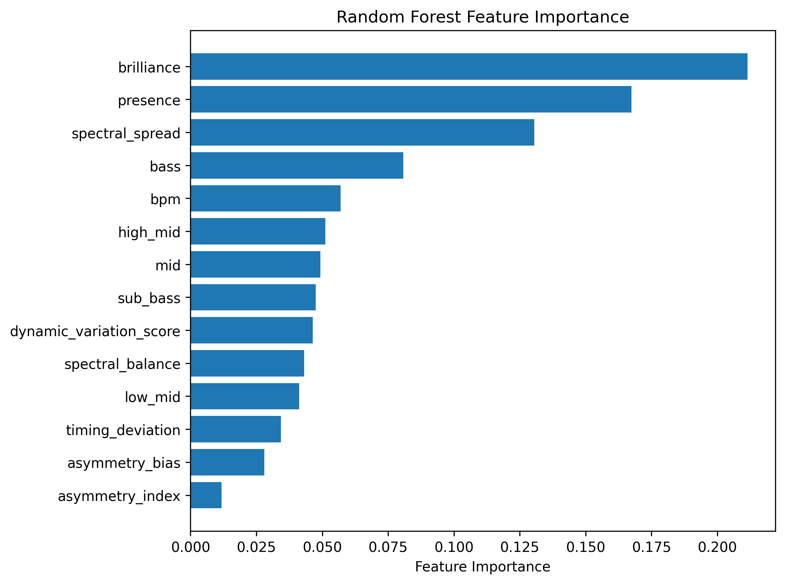
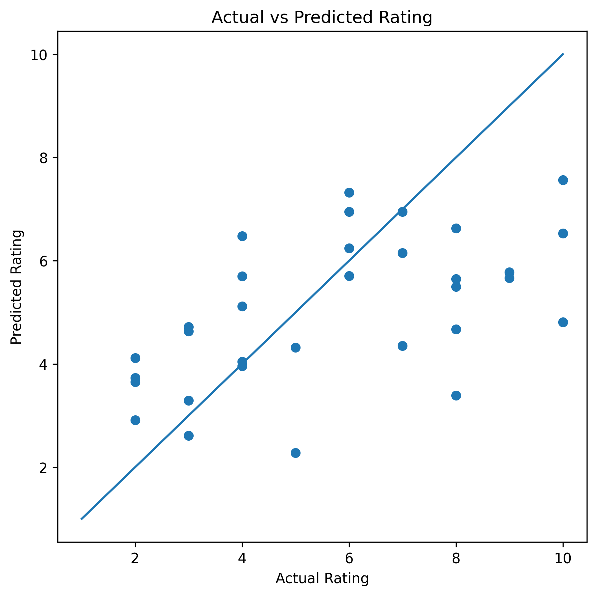

# Music Preference Prediction

A machine learning project exploring whether personal music preferences can be predicted from custom audio features extracted directly from audio files.

## Project Goal

The objective of this project is to investigate how well audio characteristics alone can explain and predict my personal song ratings.

The project combines audio signal processing, feature engineering, database management, and machine learning to build a personalized music preference model.

## Dataset

* 125 manually rated songs
* Rating scale: 1–10
* Features extracted directly from local MP3 files
* SQLite database for feature storage and rating management

Audio files are **not included** in this repository.

To analyze your own music collection, place MP3 files in:

```text
data/songs_mp3/
```

## Extracted Features

### Rhythmic Features

* BPM (Tempo)
* Timing Deviation
* Asymmetry Bias
* Asymmetry Index

### Dynamic Features

* Dynamic Variation Score

### Spectral Features

* Sub Bass
* Bass
* Low Mid
* Mid
* High Mid
* Presence
* Brilliance
* Spectral Spread
* Spectral Balance

## Machine Learning Models

The following models were evaluated:

* Ridge Regression (linear baseline)
* Random Forest Regression
* Extra Trees Regression

Model performance was evaluated using **5-Fold Cross Validation**.

## Results

### Best Performing Model: Extra Trees Regression

| Metric               | Value |
| -------------------- | ----: |
| Cross Validation R²  |  0.27 |
| Cross Validation MAE |  1.63 |

The Extra Trees model outperformed the linear baseline and Random Forest model, indicating that personal music preferences depend on non-linear interactions between audio features.

## Feature Importance



## Actual vs Predicted Ratings



## Technology Stack

* Python
* SQLite
* Pandas
* NumPy
* Librosa
* Scikit-Learn
* Matplotlib

## Installation

Clone the repository:

```bash
git clone https://github.com/YOUR_USERNAME/music-preference-prediction.git
cd music-preference-prediction
```

Create a virtual environment:

```bash
python3 -m venv venv
```

Activate the virtual environment:

### macOS / Linux

```bash
source venv/bin/activate
```

### Windows

```bash
venv\Scripts\activate
```

Install dependencies:

```bash
pip install -r requirements.txt
```

## Usage

### 1. Create the database

```bash
python3 src/create_database.py
```

### 2. Add MP3 files

Place your audio files in:

```text
data/songs_mp3/
```

### 3. Extract features

```bash
python3 src/extract_features.py
```

This will:

* Analyze all MP3 files
* Extract audio features
* Store the results in the SQLite database

### 4. Train the model

```bash
python3 src/train_model.py
```

This will:

* Load the feature database
* Train and evaluate the machine learning models
* Generate evaluation plots in the `images/` folder

## Repository Structure

```text
music-preference-prediction/
│
├── data/
│   ├── songs.db
│   └── songs_mp3/
│
├── images/
│   ├── actual_vs_predicted.png
│   └── feature_importance.png
│
├── src/
│   ├── create_database.py
│   ├── extract_features.py
│   └── train_model.py
│
├── README.md
├── requirements.txt
└── .gitignore
```

## Future Improvements

Potential future extensions include:

* Harmonic and chroma-based features
* Key and mode detection (major/minor)
* Spotify API integration
* Larger and more diverse song datasets
* Additional machine learning models and hyperparameter optimization

## License

This project is intended for educational and research purposes.
